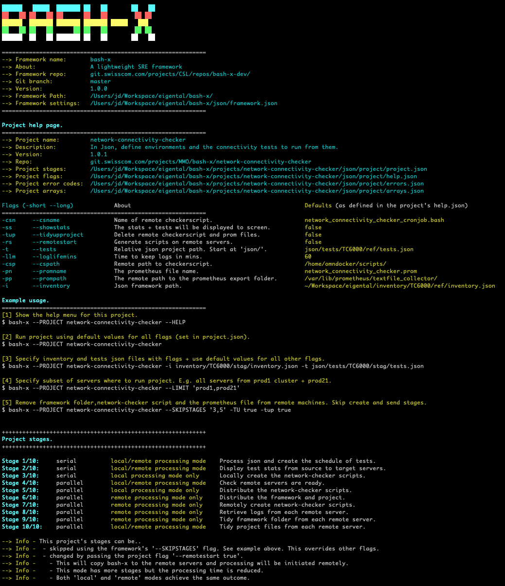

# Project: network-connectivity-checker

***    

<a name="MENU"></a>
# Quick links:
   
1. [About](#AB)        
1. [Local 'install'](#LI)            
1. [Project setup](#PS)  
1. [Project json](#PJ)                      
1. [CI/CD setup](#CICD)             
1. [Structure of tests.json](#TJ)    
1. [Project --HELP screen](#PH)     

***

<a name="AB"></a>
[menu](#MENU)          
## About.     

- This project runs using the 'bash-x' framework.   
- It automates the testing of network connectivity (tcp,udp and other protocols) between 'source' and 'target' servers.     
- It can run tests from VMs, physical machines and containers.    
- The user defines in json an 'inventory' file with 'source' and 'target' servers.     
- The user defines in json a  'tests'     file that references the inventory json and defines the tests to be run.         
- When run the project connects to each source server and generates its bespoke testing script.     
- This script is picked up by a cronjob and it writes the results to a prometheus file.     
- The setup of the cronjob and prometheus exporter is performed outside of this project, either manually or using a tool such as Ansible.     

***

<a name="LI"></a>
[menu](#MENU)           
## Local 'install'.      

- Pull this bash-x-project repository and the network-connectivity-checker project is contained within it.    

```
$ git clone ssh://git@git.swisscom.com:7999/csl/bash-x-projects.git
```       

- For framework setup and background information refer to the [bash-x README.](https://git.swisscom.com/projects/CSL/repos/bash-x/browse)     
    - This explains how to setup the framework on the local machine.    
    - Provides background to the framework structure and how its projects work.    
- For framework and project help screens use these commands.    

```
$ bash-x --HELP    
$ bash-x --PROJECT network-connectivity-checker --HELP
$ bash-x --PROJECT network-connectivity-checker.min --HELP    
```      

Note that projects may offer a minimised version of the project or a standard version or both.    
The minimised version will have the same functionality and its name will be the same but with '.min' appended to it.     

***

<a name="PS"></a>    
[menu](#MENU)         
## Project setup.        

Project setup involves three json files.    

1. **network-connectivity-checker/tests/json/help.json**.     
     - The values here determine the default settings for the project flags.    
     - You can see all the project flags in the screenshot in the below [--HELP section](#PH).    
     - Select the **authapproach** and define the **ssh** flags.     
     - Alternatively pass these parameters as runtime flags.       
1. **inventory.json**.       
     - This file contains the ips of all the source and target servers required for the tests.     
     - It uses the standard **bash-x** framework **inventory.json** format. See the inventory section in the [framework README](https://git.swisscom.com/projects/CSL/repos/bash-x/browse)    
     - The inventory file can be anywhere but is best placed in the **inventory** folder that is a sibling to the **bash-x** folder.    
     - It is recommended to use a subfolder structure like: **inventory/platform/environment/inventory.json**     
     - E.g. inventory/myservice/stag/inventory.json.    
1. **tests.json**.    
     - This references the **inventory.json** and defines the connection tests (ping, tcp, udp).    
     - It should be placed in the project subfolder **network-connectivity-checker/json/tests/**.    
     - It is recommended to use a subfolder structure like: **tests/platform/environment/tests.json**.    
     - E.g. tests/myservice/stag/tests.json.    
     - The structure of the tests.json file is explained below.   

***    

<a name="PJ"></a>
[menu](#MENU)          
## Project json.  

- All bash-x framework projects require four json files.    
- These are found in the subfolder **bash-x-projects/network-connectivity-checker/json/project/**    
- Only the **help.json** should be modified by a user of the project in order to set defaults for project flags.    
- The other three json files are specified by the project developer and should not be changed.    

1. **project.json**          
    - The definition of the project stages.    
1. **arrays.json**          
    - The declaration of all arrays used in the project.    
1. **errors.json**          
    - The declaration of all error codes used in each stage of the project.    
1. **help.json**            
    - The file used to generate the help screen for the project and where the flag defaults are set.     

***

<a name="CICD"></a>        
[menu](#MENU)         
## CI/CD pipelines.       

This project can be run locally or from a CI/CD pipeline (e.g. Jenkins, Gitlab etc).

- The project includes Jenkins files for running in Prod, Stag and Ref environments.    
- When run the pipeline pulls a container and also the **bash-x** repository.       
- The pipeline UI allows runtime selections to be made.         
- After the pipeline is run, it takes a few minutes for the results to appear in prometheus / Grafana.       

***

<a name="TJ"></a>    
[menu](#MENU)         
## Structure of the tests.json file.  

### Definition of a group.

- A **group** represents a collection of tests.   
- It is always defined with lowercase **group** and then an integer starting at 1.     
- E.g. group1 group2 group3.    
- It is an arbitrary collection but it makes sense to group all tests by interface cards as below.    
- Although it would also be possible to sub divide the tests from the same interface card into multiple groups.    
- Within the **tests.json** file, each group identifier must be unique.        

### Definition of a test.

- A **test** is always defined with lowercase **t** and then an integer starting at 1. E.g. t1 t2 t3.    
- Within a group, test numbers must always be unique.

### The 'from' and 'to' fields.

These fields reference the **inventory.json** file.    

**Example 1:**        

- This defines tests from all the source servers to all the target servers over tcp-12850.     
- The source servers are defined in the 'from' field.    
- The taregt servers are defined in the 'to' field.    
- In the inventory.json the 'domain', 'interface' and 'gateway' fields are skipped and tests originate only from the server ip addresses.     

**group1_t1_from**      
- get the server ips under **inventory_servers_prod1_service_default**.  (source servers).     
- get the server ips under **inventory_servers_prod2_service_default**.  (source servers).     

**group1_t1_to**        
- get the server ips under **inventory_services_acme_abc**.              (target servers).       

**Example 2:**       

- This example has a different parentheses structure.    
- This will run ping tests from those servers defined in each **from** parenthesis to the corresponding **to** parenthesis.     
- Note there must be an equal number of parentheses in the **from** and **to** fields.    

**group2_t1**       
- The **source servers** defined in the first  **from** parenthesis will test only against the **target servers** defined in the first  **to** parenthesis.    
- The **source servers** defined in the second **from** parenthesis will test only against the **target servers** defined in the second **to** parenthesis.    

```json
{
    "tests":{
        "name":                 "platformX_prod",
        "description":          "Tests over the two interfaces on platformX VMs in the production environment.",
        "environment":          "prod",
        "group1":{
            "interface":        "eth0",
            "description":      "The default interface.", 
            "t1":{
                "description":  "ABC connectivity is required for..",
                "from":         "{inventory_servers_prod1_service_default,inventory_servers_prod2_service_default}",
                "to":           "{inventory_services_acme_abc}",
                "test":         "tcp-12850",
                "type":         "default_abc",
                "direction":    "out"  
            },
            "t2":{
                "description":  "DEF connectivity is required for..",
                "from":         "{inventory_servers_prod1_service_default,inventory_servers_prod2_service_default}",
                "to":           "{inventory_services_acme_def}",
                "test":         "tcp-8180;tcp-8181",
                "type":         "default_def",
                "direction":    "out"  
            }
        },
        "group2":{
            "interface":        "eth1",
            "description":      "This interface is used for this type of traffic..", 
            "t1":{
                "description":  "GHI connectivity is required for..",
                "from":         "{inventory_servers_prod1_service_default}{inventory_servers_prod2_service_default}",
                "to":           "{inventory_services_acme1_ghi}{inventory_services_acme2_ghi}",
                "test":         "ping",
                "type":         "default_ghi",
                "direction":    "out"  
            }
        }
    }
}
```     

***
<a name="PH"></a>     
[menu](#MENU)         
## Project --HELP screen.    

{height=1836 width=1398}
